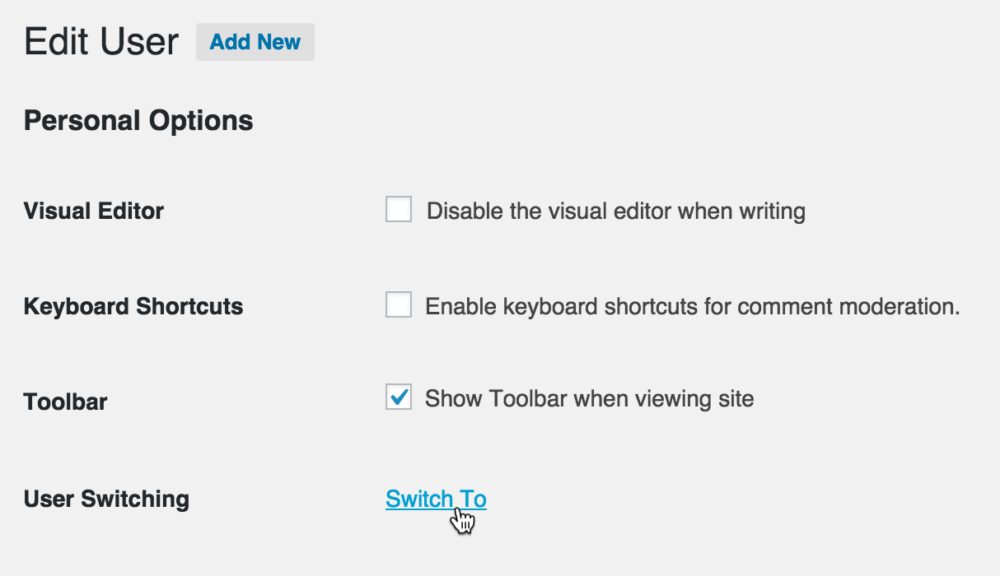

# User Switching

Stable tag: 1.5.8  
Requires at least: 3.7  
Tested up to: 5.8  
Requires PHP: 5.3  
License: GPL v2 or later  
Tags: users, profiles, user switching, fast user switching, multisite, buddypress, bbpress, become, user management, developer  
Contributors: johnbillion  
Donate link: https://github.com/sponsors/johnbillion

Instant switching between user accounts in WordPress.

## Description

This plugin allows you to quickly swap between user accounts in WordPress at the click of a button. You'll be instantly logged out and logged in as your desired user. This is handy for test environments where you regularly log out and in between different accounts, or for administrators who need to switch between multiple accounts.

### Features

 * Switch user: Instantly switch to any user account from the *Users* screen.
 * Switch back: Instantly switch back to your originating account.
 * Switch off: Log out of your account but retain the ability to instantly switch back in again.
 * Switching between users is secure (see the *Security* section below).
 * Compatible with WordPress, WordPress Multisite, WooCommerce, BuddyPress, bbPress, and most two-factor authentication plugins.

### Security

 * Only users with the ability to edit other users can switch user accounts. By default this is only Administrators on single site installations, and Super Admins on Multisite installations.
 * Passwords are not (and cannot be) revealed.
 * Uses the cookie authentication system in WordPress when remembering the account(s) you've switched from and when switching back.
 * Implements the nonce security system in WordPress, meaning only those who intend to switch users can switch.
 * Full support for user session validation where appropriate.
 * Full support for administration over SSL (if applicable).

### Usage

 1. Visit the *Users* menu in WordPress and you'll see a *Switch To* link in the list of action links for each user.
 2. Click this and you will immediately switch into that user account.
 3. You can switch back to your originating account via the *Switch back* link on each dashboard screen or in your profile menu in the WordPress toolbar.

See the [FAQ](https://wordpress.org/plugins/user-switching/faq/) for information about the *Switch Off* feature.

### Other Plugins

I maintain several other plugins for developers. Check them out:

* [Query Monitor](https://wordpress.org/plugins/query-monitor/) is the developer tools panel for WordPress
* [WP Crontrol](https://wordpress.org/plugins/wp-crontrol/) lets you view and control what's happening in the WP-Cron system

### Privacy Statement

User Switching makes use of browser cookies in order to allow users to switch to another account. Its cookies operate using the same mechanism as the authentication cookies in WordPress core, therefore their values contain the user's `user_login` field in plain text which should be treated as potentially personally identifiable information. The names of the cookies are:

* `wordpress_user_sw_{COOKIEHASH}`
* `wordpress_user_sw_secure_{COOKIEHASH}`
* `wordpress_user_sw_olduser_{COOKIEHASH}`

User Switching does not send data to any third party, nor does it include any third party resources, nor will it ever do so.

See also the FAQ for some questions relating to privacy and safety when switching between users.

### Ethical Open Source

User Switching is considered **Ethical Open Source** because it meets all of the criteria of [The Ethical Source Definition (ESD)](https://ethicalsource.dev/definition/):

1. It benefits the commons.
2. It is created in the open.
3. Its community is welcoming and just.
4. It puts accessibility first.
5. It prioritizes user safety.
6. It protects user privacy.
7. It encourages fair compensation.

## Screenshots

1. The *Switch To* link on the Users screen 

2. The *Switch To* link on a user's profile 

## Frequently Asked Questions

### Does this plugin work with PHP 8?

Yes, it's actively tested and working up to PHP 8.1.

### What does "Switch off" mean?

Switching off logs you out of your account but retains your user ID in an authentication cookie so you can switch straight back without having to log in again manually. It's akin to switching to no user, and being able to switch back.

The *Switch Off* link can be found in your profile menu in the WordPress toolbar. Once you've switched off you'll see a *Switch back* link on the Log In screen and in the footer of your site.

### Does this plugin work with WordPress Multisite?

Yes, and you'll also be able to switch users from the Users screen in Network Admin.

### Does this plugin work with BuddyPress?

Yes, and you'll also be able to switch users from member profile screens and the member listing screen.

### Does this plugin work with bbPress?

Yes, and you'll also be able to switch users from member profile screens.

### Does this plugin work with WooCommerce?

Yes. For maximum compatibility you should use WooCommerce version 3.6 or later.

### Does this plugin work if my site is using a two-factor authentication plugin?

Yes, mostly.

One exception I'm aware of is [Duo Security](https://wordpress.org/plugins/duo-wordpress/). If you're using this plugin, you should install the [User Switching for Duo Security](https://github.com/johnbillion/user-switching-duo-security) add-on plugin which will prevent the two-factor authentication prompt from appearing when you switch between users.

### What capability does a user need in order to switch accounts?

A user needs the `edit_users` capability in order to switch user accounts. By default only Administrators have this capability, and with Multisite enabled only Super Admins have this capability.

### Can the ability to switch accounts be granted to other users or roles?

Yes. The `switch_users` meta capability can be explicitly granted to a user or a role to allow them to switch users regardless of whether or not they have the `edit_users` capability. For practical purposes, the user or role will also need the `list_users` capability so they can access the Users menu in the WordPress admin area.

### Can the ability to switch accounts be denied from users?

Yes. User capabilities in WordPress can be set to `false` to deny them from a user. Denying the `switch_users` capability prevents the user from switching users, even if they have the `edit_users` capability.

    add_filter( 'user_has_cap', function( $allcaps, $caps, $args, $user ) {
        if ( 'switch_to_user' === $args[0] ) {
            if ( my_condition() ) {
                $allcaps['switch_users'] = false;
            }
        }
        return $allcaps;
    }, 9, 4 );

Note that this needs to happen before User Switching's own capability filtering, hence the priority of `9`.

### Can I add a custom "Switch To" link to my own plugin or theme?

Yes. Use the `user_switching::maybe_switch_url()` method for this. It takes care of authentication and returns a nonce-protected URL for the current user to switch into the provided user account.

    if ( method_exists( 'user_switching', 'maybe_switch_url' ) ) {
        $url = user_switching::maybe_switch_url( $target_user );
        if ( $url ) {
            printf(
                '<a href="%1$s">Switch to %2$s</a>',
                esc_url( $url ),
                esc_html( $target_user->display_name )
            );
        }
    }

This link also works for switching back to the original user, but if you want an explicit link for this you can use the following code:

    if ( method_exists( 'user_switching', 'get_old_user' ) ) {
        $old_user = user_switching::get_old_user();
        if ( $old_user ) {
            printf(
                '<a href="%1$s">Switch back to %2$s</a>',
                esc_url( user_switching::switch_back_url( $old_user ) ),
                esc_html( $old_user->display_name )
            );
        }
    }

### Can I determine whether the current user switched into their account?

Yes. Use the `current_user_switched()` function for this.

    if ( function_exists( 'current_user_switched' ) ) {
        $switched_user = current_user_switched();
        if ( $switched_user ) {
            // User is logged in and has switched into their account.
            // $switched_user is the WP_User object for their originating user.
        }
    }

### Does this plugin allow a user to frame another user for an action?

Potentially yes, but User Switching includes some safety protections for this and there are further precautions you can take as a site administrator:

* User Switching stores the ID of the originating user in the new session for the user they switch to. Although this session does not persist by default when they subsequently switch back, there will be a record of this ID if your MySQL server has query logging enabled.
* User Switching stores the login name of the originating user in an authentication cookie (see the Privacy Statement for more information). If your server access logs store cookie data, there will be a record of this login name (along with the IP address) for each access request.
* You can install an audit trail plugin such as Simple History, WP Activity Log, or Stream, all of which have built-in support for User Switching and all of which log an entry when a user switches into another account.
* User Switching triggers an action when a user switches account, switches off, or switches back (see below). You can use these actions to perform additional logging for safety purposes depending on your requirements.

One or more of the above should allow you to correlate an action with the originating user when a user switches account, should you need to.

Bear in mind that even without the User Switching plugin in use, any user who has the ability to edit another user can still frame another user for an action by, for example, changing their password and manually logging into that account. If you are concerned about users abusing others, you should take great care when granting users administrative rights.

### Can regular admins on Multisite installations switch accounts?

No. This can be enabled though by installing the [User Switching for Regular Admins](https://github.com/johnbillion/user-switching-for-regular-admins) plugin.

### Can I switch users directly from the admin toolbar?

Yes, there's a third party add-on plugin for this: [Admin Bar User Switching](https://wordpress.org/plugins/admin-bar-user-switching/).

### Are any plugin actions called when a user switches account?

Yes. When a user switches to another account, the `switch_to_user` hook is called:

    /**
     * Fires when a user switches to another user account.
     *
     * @since 0.6.0
     * @since 1.4.0 The `$new_token` and `$old_token` parameters were added.
     *
     * @param int    $user_id     The ID of the user being switched to.
     * @param int    $old_user_id The ID of the user being switched from.
     * @param string $new_token   The token of the session of the user being switched to. Can be an empty string
     *                            or a token for a session that may or may not still be valid.
     * @param string $old_token   The token of the session of the user being switched from.
     */
    do_action( 'switch_to_user', $user_id, $old_user_id, $new_token, $old_token );

When a user switches back to their originating account, the `switch_back_user` hook is called:

    /**
     * Fires when a user switches back to their originating account.
     *
     * @since 0.6.0
     * @since 1.4.0 The `$new_token` and `$old_token` parameters were added.
     *
     * @param int       $user_id     The ID of the user being switched back to.
     * @param int|false $old_user_id The ID of the user being switched from, or false if the user is switching back
     *                               after having been switched off.
     * @param string    $new_token   The token of the session of the user being switched to. Can be an empty string
     *                               or a token for a session that may or may not still be valid.
     * @param string    $old_token   The token of the session of the user being switched from.
     */
    do_action( 'switch_back_user', $user_id, $old_user_id, $new_token, $old_token );

When a user switches off, the `switch_off_user` hook is called:

    /**
     * Fires when a user switches off.
     *
     * @since 0.6.0
     * @since 1.4.0 The `$old_token` parameter was added.
     *
     * @param int    $old_user_id The ID of the user switching off.
     * @param string $old_token   The token of the session of the user switching off.
     */
    do_action( 'switch_off_user', $old_user_id, $old_token );

In addition, User Switching respects the following filters from WordPress core when appropriate:

* `login_redirect` when switching to another user.
* `logout_redirect` when switching off.

### Do you accept donations?

[I am accepting sponsorships via the GitHub Sponsors program](https://github.com/sponsors/johnbillion) and any support you can give will help me maintain this plugin and keep it free for everyone.

<!-- changelog -->
